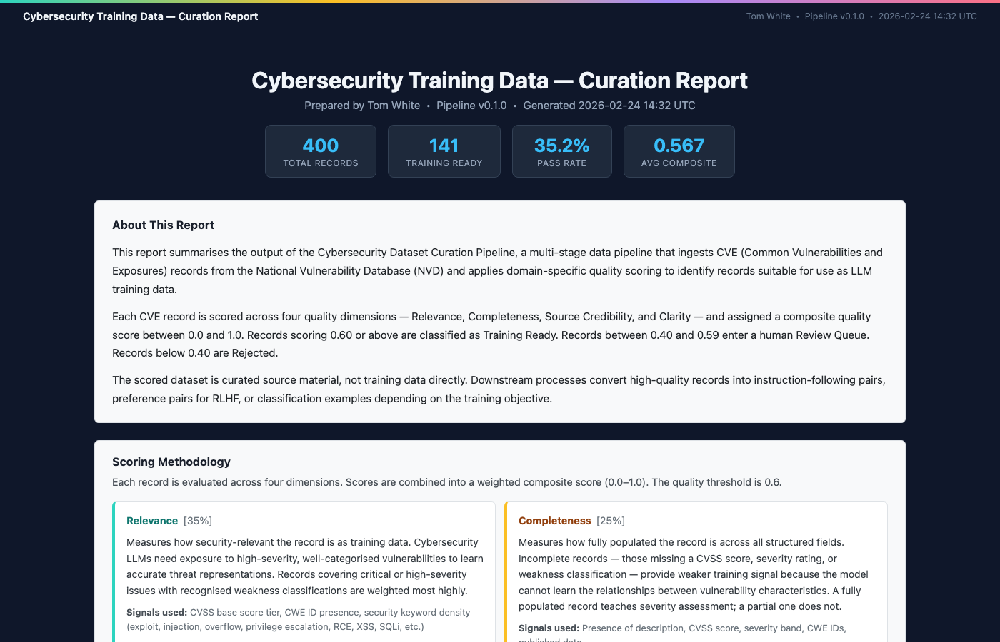

# Cybersecurity Dataset Curation Pipeline

A domain-specific curation pipeline for cybersecurity training data, ingesting CVE records from NVD and HuggingFace, applying security-relevant quality scoring, and outputting a curated JSONL dataset with a Data Card.

> **Part of a two-project portfolio demonstrating LLM training data operations across coding and cybersecurity domains. See also: [LLM Data Quality Scoring Pipeline](https://github.com/whitet-96/llm-dq-scoring)**



---

## Why This Project

Cybersecurity data presents unique challenges compared to general code data:

- **Quality signals are domain-inverted**: exploit code and vulnerability descriptions are *valuable* training signal, not rejects. A high-CVSS, well-documented exploit is a gold record — the opposite of most content moderation pipelines.
- **Provenance matters more**: sourcing from authoritative databases (NVD/NIST) vs. scraped forums has significant impact on reliability and legal standing. A CVE from NVD is verifiable; one from a random paste-site is not.
- **Ethical and legal sensitivity**: dataset documentation must carefully address intended use. Vulnerability data can be misused, so the Data Card explicitly scopes acceptable downstream applications.

---

## Pipeline Architecture

```
NVD API      →  Dedup/Norm  →  Relevance (35%)   →  Tiered Filter  →  training_final.jsonl
HuggingFace  →              →  Completeness (25%) →  Stratified     →  review_queue.jsonl
                            →  Source Cred. (25%) →  Sample         →  HTML Report
                            →  Clarity (15%)      →  Decontaminate
```

---

## Sample Report

A pre-generated report is included in the repository. Download and open it locally to see the pipeline output before running anything:

> **[Download sample_report.html](https://raw.githubusercontent.com/whitet-96/llm-training-cyber/main/docs/sample_report.html)** — right-click → Save As, then open in any browser.

The report covers 400 CVE records (200 NVD + 200 HuggingFace) and includes training readiness breakdown, composite score distribution, dimension box plots, severity distribution, top-20 records table, and a per-record dimension heatmap.

---

## Quick Start

```bash
git clone https://github.com/whitet-96/llm-training-cyber.git
cd llm-training-cyber
pip install -r requirements.txt
python main.py --stage all --max-records 500
```

Run individual stages:

```bash
python main.py --stage ingest --max-records 100
python main.py --stage score
python main.py --stage filter
python main.py --stage report
```

---

## Project Structure

```
cyb-dq-curation/
├── main.py                  # Pipeline entrypoint with argparse
├── config.py                # Thresholds, weights, paths, constants
├── ingestion/
│   └── ingest.py            # NVD API + HuggingFace ingestion
├── scoring/
│   └── score.py             # Domain-specific quality scoring
├── filtering/
│   └── filter.py            # Tiered filter, stratified sampling, decontamination
├── reporting/
│   └── report.py            # Standalone HTML report generator
├── docs/
│   ├── DATA_CARD.md         # Dataset documentation
│   └── sample_report.html   # Sample pipeline report (generated output)
├── data/
│   ├── raw/                 # Raw ingested data (gitignored)
│   ├── scored/              # Scored JSONL output (gitignored)
│   └── filtered/            # Filter stage outputs (gitignored)
├── tests/
│   ├── test_scoring.py      # pytest unit tests for scoring logic
│   └── test_filtering.py    # pytest unit tests for filter pipeline
├── .gitignore
├── requirements.txt
└── README.md
```

---

## Scoring Methodology

| Dimension | Weight | Method |
|---|---|---|
| **Relevance** | 35% | CVSS score severity tier + CWE presence + security keyword density in description |
| **Completeness** | 25% | Presence of description, CVSS score, severity, CWE IDs, published date |
| **Source Credibility** | 25% | Source authority (NVD=1.0, HuggingFace=0.6) + CVSS boost |
| **Clarity** | 15% | Description length bands; penalises NVD placeholder text |

**Quality threshold: 0.60** (vs. 0.70 in the companion coding pipeline)

The lower threshold is intentional: cybersecurity descriptions are structurally sparser than well-documented code. NVD descriptions are authoritative but often terse — penalising them for brevity would discard high-signal records. The threshold is calibrated to retain verified, CVSS-scored records while rejecting placeholder entries and empty stubs.

---

## From Scored Data to Training-Ready

The scored JSONL is not training data directly — it is curated source material. Each record in `cves_scored.jsonl` carries quality scores and a `training_ready` flag, but it still describes a CVE in raw form. Downstream formatting converts these records into training examples: instruction-following pairs ("Explain CVE-2023-44487"), preference pairs for RLHF, or classification examples for severity prediction. The curation pipeline deliberately stops at the source material boundary so it remains format-agnostic and reusable across different training objectives.

Tiered filtering separates training-ready records from a human review queue, avoiding the false economy of a single binary threshold. A composite score of 0.58 is not categorically different from 0.62, yet a hard cutoff treats them as opposite outcomes. The review queue surfaces borderline records for human annotation rather than silently discarding them — which matters in a domain where manually reviewing one hundred CVEs produces meaningfully better coverage than relying entirely on automated scoring.

Stratified sampling corrects for NVD's severity skew before training data is assembled. Roughly 40–50% of NVD records carry MEDIUM severity. Without correction, a model trained on unsampled data develops a skewed understanding of the vulnerability landscape: it handles MEDIUM cases well but underperforms on CRITICAL and LOW, which is exactly wrong for a security assistant. Sampling up to a fixed quota per severity tier ensures the training subset represents the full spectrum of vulnerability types.

Decontamination isolates post-cutoff records so they can be used for fine-tuning evaluation without polluting pre-training data. CVEs published after a model's knowledge cutoff are potential overlap with security benchmarks and red-team evaluation sets that use recent vulnerabilities as held-out test cases. Rather than silently including or excluding these records, the pipeline flags and isolates them in `flagged_contamination.jsonl`, giving downstream practitioners the information they need to make an informed decision.

---

## Output Format

```json
{
  "cve_id": "CVE-2023-44487",
  "description": "The HTTP/2 protocol allows...",
  "published": "2023-10-10",
  "cvss_score": 7.5,
  "severity": "HIGH",
  "cwe_ids": ["CWE-400"],
  "source": "nvd",
  "relevance_score": 0.85,
  "completeness_score": 0.90,
  "source_credibility_score": 1.0,
  "clarity_score": 0.70,
  "composite_score": 0.87,
  "training_ready": true,
  "pipeline_version": "v0.1.0",
  "scored_at": "2026-02-23T12:00:00Z"
}
```

---

## Ethical Considerations

- All data is sourced from public, authoritative databases (NVD/NIST — public domain; HuggingFace mirror — CC0-1.0)
- No exploit code or PoC payloads are ingested — descriptions only
- Intended for training models to **understand and explain** vulnerabilities, not to facilitate attacks
- See [docs/DATA_CARD.md](docs/DATA_CARD.md) for full intended use statement

---

## Roadmap

- [ ] Add CWE taxonomy enrichment (map CWE IDs to categories)
- [ ] Extend to NVD CPE data for affected product context
- [ ] Add LLM-based scoring for description quality (as in Project 1)
- [ ] GitHub Actions CI for scheduled weekly NVD pulls
- [ ] Merge with Project 1 into unified multi-domain training data platform
